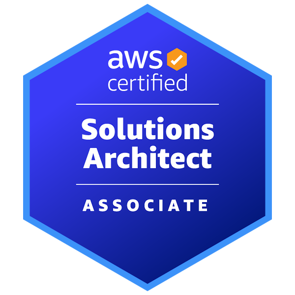
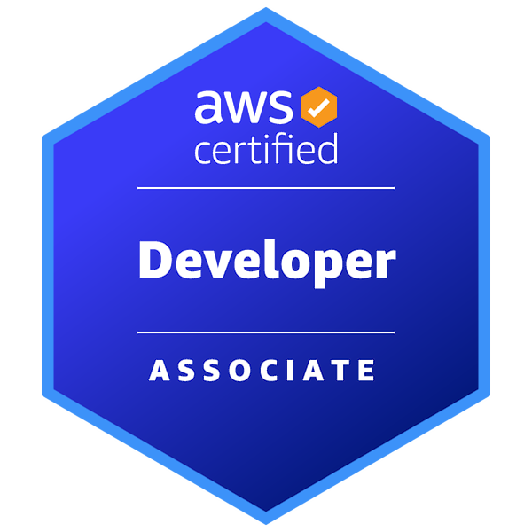

> A decade trying to make the world a better place, a byte at a time

👋 Hi there! My name is Camilo and I'm a software engineer with over a decade of experience.
I'm passionate about creating cutting-edge software that is not only performant, but also modern, secure, and testable.

Over the years, I have worked on a variety of environments, ranging from large-scale enterprise to small startups.
Throughout these experiences, I've developed a sharp eye for detail and an understanding of what it takes to write code that is not only functional, but also elegant and efficient.

As a full-stack engineer, I rely on a variety of tools to help me build applications.
While my biggest experience lies in React and Node, I've also had the pleasure of working with other technologies, such as Go and Rust, which I find to be powerful and efficient languages for building high-performance applications.

🏔 I thoroughly enjoy mountaineering which helped me overcome my fear of heights while building strong team management
skills, and it keeps my adrenaline levels high.

  
  

