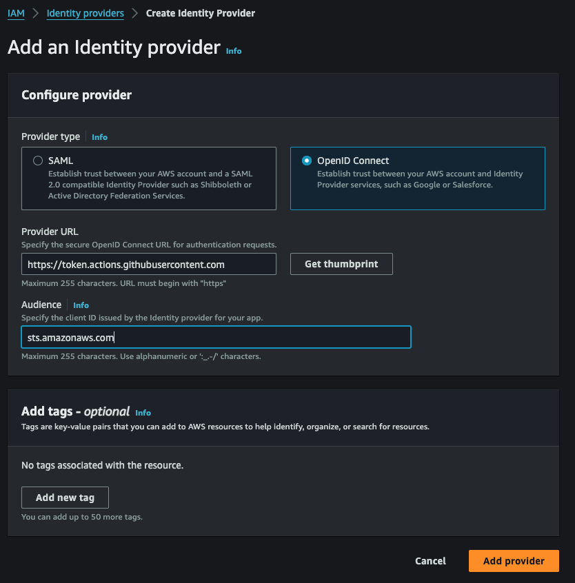
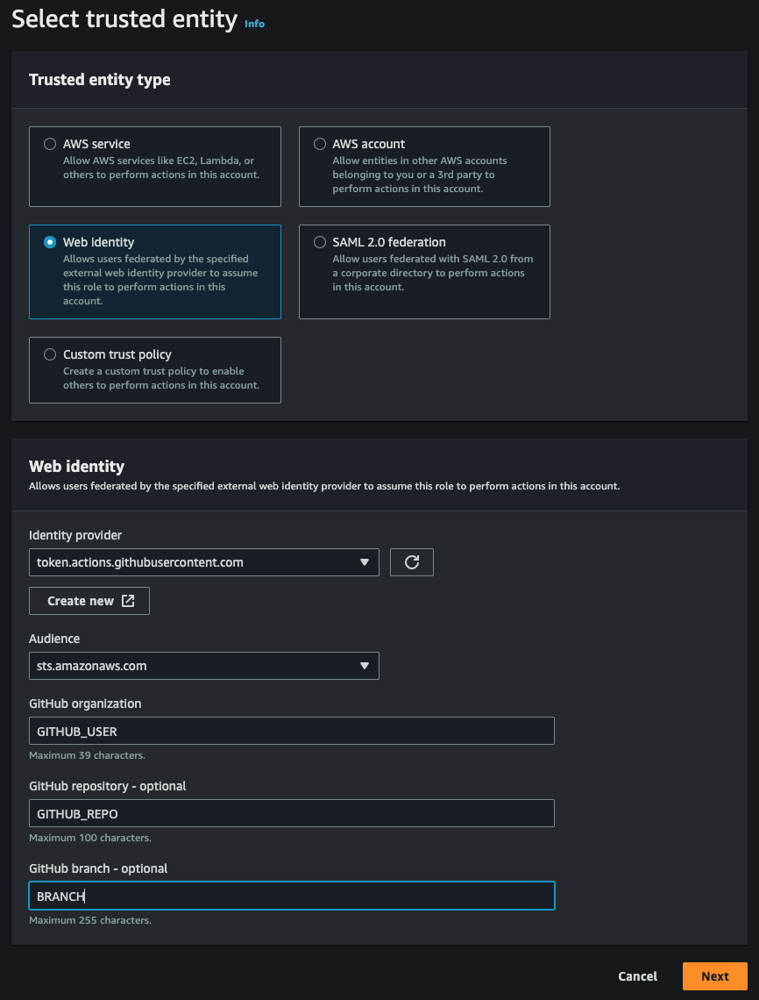

> Deploy AWS CDK resources with Github Actions with OpenID Connect (OIDC)

There are 3 steps to deploy AWS CDK from Github Actions:

1. Create IAM OIDC Identity Provider
2. Create Role for Identity Provider
3. Create Github Action

## Context

There are different solutions to authenticate when deploying AWS resources using a CI/CD pipeline with Github Actions.
It is possible to create an IAM user and store the credentials on Github secrets, but [this is discouraged](https://github.com/aws-actions/configure-aws-credentials?tab=readme-ov-file#OIDC).
A better solution is to crete short-lived credentials using OpenID Connect ([OIDC](https://auth0.com/docs/authenticate/protocols/openid-connect-protocol#:~:text=OpenID%20Connect%20(OIDC)%20is%20an,to%20the%20OAuth%202.0%20specifications.)) Protocol.

The basics consists of configuring [AWS](https://docs.aws.amazon.com/IAM/latest/UserGuide/id_roles_providers_create_oidc.html) and [Github](https://docs.github.com/en/actions/deployment/security-hardening-your-deployments/configuring-openid-connect-in-amazon-web-services) so that Github can request temporary access (using [STS](https://docs.aws.amazon.com/STS/latest/APIReference/welcome.html)) and deploy CDK resources.

Each step detailed below:

## Create IAM OIDC Identity Provider (IdP)

> Detailed documentation can be found [here](https://docs.aws.amazon.com/IAM/latest/UserGuide/id_roles_providers_create_oidc.html#manage-oidc-provider-console).

Create an Identity Provider (IdP) in the console looks like the image below.

The values for `Provider URL` and `Audience` are determined by the provider (Github).
The [Github docs](https://docs.github.com/en/actions/deployment/security-hardening-your-deployments/configuring-openid-connect-in-amazon-web-services#adding-the-identity-provider-to-aws) instructs to use the following values:

- Provider URL: `https://token.actions.githubusercontent.com`
- Audience: `sts.amazonaws.com`



## Create Role for Identity Provider

> Detailed documentation can be found [here](https://docs.aws.amazon.com/IAM/latest/UserGuide/id_roles_create_for-idp_oidc.html#idp_oidc_Create)

Select the newly created IdP and chose `Assign role` > `Create a new role` and add `AdministratorAccess` to the role.
This role is required so that Github Actions can manage the resources in the CDK application.

> [!Note]
> Do not forget to change the variables with your values `GITHUB_USER`, `GITHUB_REPO` and `BRANCH`.



## Create Github Action

The last step is to instruct Github Actions to assume the authorized role.

Sample of Github Actions to use in `.github/workflows/deploy.yaml`.
Don't forget to replace the following variables and checkout the [docs](https://docs.github.com/en/actions/quickstart) for a more customized deployment:

- `AWS_ACCOUNT_ID`: your account ID
- `AWS_REGION`: the AWS region you are deploying to
- `CDK_VERSION`: the latest version I tested was `2.118.0`
- `ROLE_NAME`: the name used in the previous step to create the role
- `STACK_NAME`: the name of the stack you are deploying


```yaml
name: deploy

on: [push]

# required
# https://github.com/aws-actions/configure-aws-credentials?tab=readme-ov-file#OIDC
permissions:
  id-token: write
  contents: read

env:
  CDK_VERSION: CDK_VERSION

jobs:
  deploy:
    name: Deploy
    runs-on: ubuntu-latest
    steps:
      - name: Checkout Code
        uses: actions/checkout@v4

      # Official AWS action for credential resolution
      - name: Configure AWS credentials
        uses: aws-actions/configure-aws-credentials@v4
        with:
          audience: sts.amazonaws.com
          aws-region: AWS_REGION
          role-to-assume: arn:aws:iam::<AWS_ACCOUNT_ID>:role/<ROLE_NAME>

      - name: Install Dependencies
        run: |
          yarn install
          npm install -g aws-cdk@$CDK_VERSION

      - name: CDK Deploy
        run: |
          cdk synth --all
          cdk doctor
          cdk deploy --require-approval=never <STACK_NAME>
```

## References

- AWS OIDC [doc](https://docs.aws.amazon.com/IAM/latest/UserGuide/id_roles_providers_create_oidc.html)
- Github OIDC with AWS [doc](https://docs.github.com/en/actions/deployment/security-hardening-your-deployments/configuring-openid-connect-in-amazon-web-services#adding-the-identity-provider-to-aws)
- Github Action [configure-aws-credentials](https://github.com/aws-actions/configure-aws-credentials?tab=readme-ov-file#OIDC): OIDC instructions